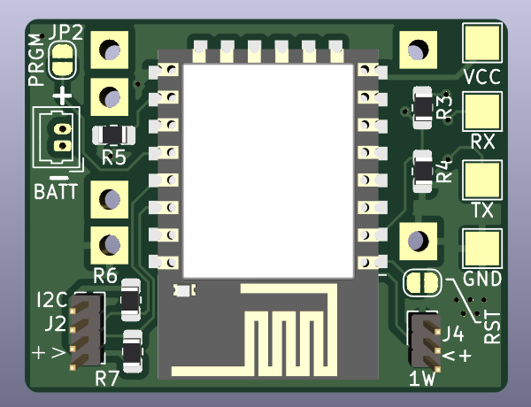
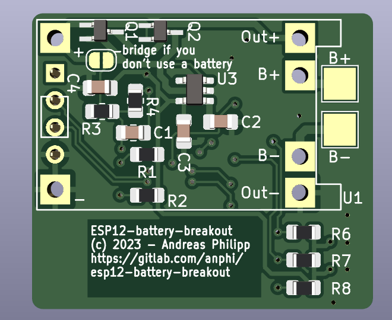

# esp12-breakout

*Work in progress*

This project aims to build a small versatile ESP8266 breakout board
to use for homeautomation projects. It can be battery-powered if desired.

It features an breakout of all GPIO pins with the possibility
to solder pullup resistors for I²C and OneWire. All pins can be accessed
and soldered to via dedicated pads on the front side.
Programming is accomplished via a 4 pin header which breaksout the UART.
Then use your favorite serial adapter to connect to the board. 

### Rendered board

  
  

The whole board only measures 32 mm  * 28 mm.
Height depends on whether you use a battery and on the sensors you are using.

### Features
* Dimensions: W * H : 31,9 mm * 27,8 mm
* Input voltage: 3.0 < V_in < 5.5
* metal pads for reset and programming mode
* TP4056 based charging and protection circuit for LiOn/LiPo batteries
* integrated 3,3 V LDO voltage regultor
* optional pullup resistors for busses like I²C and OneWire
* Programming via pin header
### Assembly
There are some things to consider depending if you use a battery or
a power supply to power this project.
The voltage regulator only can deliver about 500 mA.
Make sure to not draw to much current with any additional sensors.

##### Battery
1. Check that your battery supports the selected charging current of the
   charging circuit. This can be set by a resistor. See the [datasheet](https://dlnmh9ip6v2uc.cloudfront.net/datasheets/Prototyping/TP4056.pdf) for more 
   information on which resistor value to set.
2. Make sure to populate Q1 and D1 to switch to the power supply
   while plugged in to prevent charging and powering the circuit by battery
   at the same time. This is not supported by the charger and should be
   avoided.
3. Solder your battery directly to the battery pads on the backside of the board.

##### Power supply
1. Short JP3 and don't populate Q1, D1 and U1.  
   This makes connection between the
   `+` pad and the supply rail.
2. Connect your power supply to `+` and `-`. (left contact pads on the backside image)

##### Pullup Resistors
1. `R6`, `R7`, `R8` can be populated with a 4,7 k resistor to provide onboard pullup
   resistance for some busses like I²C.  
   Only populate if you want to use these pins for a bus.

### Programming
1. Connect to the UART header with your favorite 3,3 V programmer.
2. Short `PRGM` and `RST` jumpers with a metal object to set the ESP into
   bootloader mode. Now you can start the programming process. 
   (`esptool` or directly from `esphome`)
