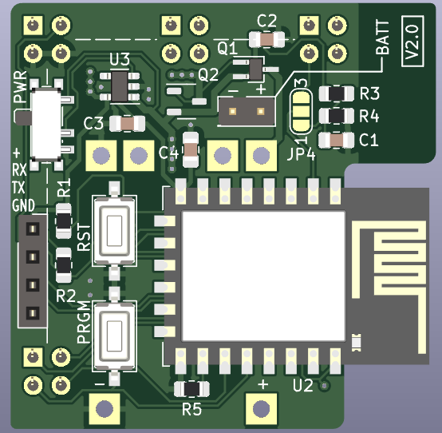
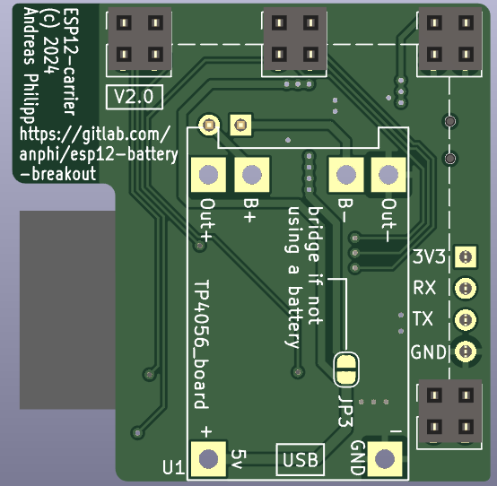

# esp12-breakout

This project provides different variants for breakout boards 
to use with the ESP-12 modules featuring an ESP8266.

It features the following boards:
## [simple breakout](res/simple-breakout.md)  
     
     

   This just exposes some all available
   GPIO pins on this board to pads on the front where you can solder sensors
   or other peripherals to. It has the dimensions 45*43 mm to perfectly
   fit in [this](https://www.reichelt.de/sensorgehaeuse-51x51x25-5-mm-massiv-weiss-cb-rs03swh-p317702.html) small sensor case.  
   It has an TP4056 board piggy backed to allow for battery powered applications.

## [esp carrier + daughterboard](res/stackable.md)  
     
     
   For more complex builds you have the possibility to stack two board on each other.
   The carrier is readiliy designed and fits into the lower right corner of the
   board. Using the template in the provided footprint library you can design
   a matching daugtherboard which fits your needs. This gets mounted in the 
   case and the carrier board gets plugged in on tip of it.
